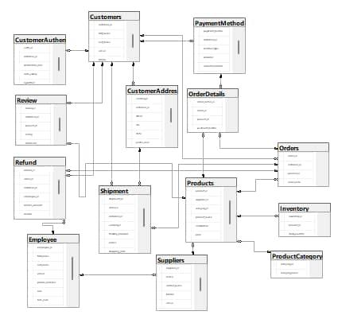

# Global-Gadgets-Database-Design-and-implementation
An E-commerce Database Management System 

---
# Introduction 

In today’s digital economy, **e-commerce** has emerged as one of the fastest-growing sectors, enabling businesses to sell goods and services to customers through online platforms. As the scale of operations increases, managing large volumes of data related to **customers, suppliers, products, orders, shipments, and payments** becomes a significant challenge. 

Traditional manual systems and unstructured data storage methods often lead to inefficiencies such as **data redundancy, inconsistency,** and **difficulty in retrieving information**.

To address these challenges, **Relational Database Management Systems (RDBMS)** are employed to store, organize, and manage business-critical information. This project focuses on the **design and implementation of a database system** for e-commerce operations. The system ensures **accurate record-keeping**, **enforces business rules**, and **facilitates smooth data flow** between different entities such as customers, orders, inventory, and suppliers.

---
## Problem Statement 

E-commerce businesses often struggle with managing **customer records**, **tracking orders**, **updating delivery status**, **handling product inventory**, and **processing payments** efficiently. Without a well-structured database:

- Customer details and addresses may be **duplicated or inconsistent**.  
- Orders and shipments may not be **accurately tracked**.  
- Inventory levels may not reflect **real-time stock availability**.  
- Refunds and reviews may not be **properly linked** to their respective transactions.  

These issues can result in **customer dissatisfaction**, **financial losses**, and **inefficiency in decision-making**. Therefore, there is a need for a **centralized database system** that integrates all business processes and ensures **data accuracy**.

---
## Aims and Objectives 

The aim of this project is to **design and implement a relational database management system (RDBMS)** for an e-commerce platform that ensures **efficient data management** and **operational automation**.

 **Specific Objectives**

The specific objectives of this project are to:

1. **Design** a relational database schema for managing customer, supplier, product, order, and inventory records.  
2. **Enforce data integrity** through the use of primary keys, foreign keys, and constraints.  
3. **Implement triggers** to automate business rules such as updating order status upon delivery.  
4. **Provide sample data insertion** to test the efficiency and functionality of the system.  
5. **Ensure scalability and reliability** of the database for future growth and expansion.
---
## Project Scope

This project is limited to the **design and implementation of a relational database** for an e-commerce system.  

The scope includes:

- Creation of tables for **customers**, **customer addresses**, **suppliers**, **product categories**, **products**, **inventory**, **orders**, **order details**, **payments**, **shipments**, **reviews**, **refunds**, and **employees**.  
- Application of **triggers**, **constraints**, and **stored procedures** to enforce business rules.  
- **Sample data insertion** for testing and validating the database design.

However, this project **does not include** the development of a full **e-commerce website** or **front-end application**. The focus remains on the **back-end database design and implementation**.

---
## Project Significance 

This project is significant in several ways:

- It demonstrates the role of **database systems** in enhancing **efficiency** and **accuracy** in e-commerce operations.  
- It provides a **foundation for developers** who may wish to expand the system into a full-scale e-commerce application.  
- It serves as a **reference for researchers** interested in database design and implementation.  
- **Businesses** can adapt the system to improve their **order processing**, **customer management**, and **inventory control**.
---
## Database Design Overview 

The system was designed to capture all essential aspects of an e-commerce platform.  
The main entities include:

- **Customers:** Stores user details such as name, email, and contact information.  
- **Customer Address:** Maintains multiple shipping addresses for customers.  
- **Products:** Contains information about items available for sale.  
- **Product Categories:** Organizes products into logical groups.  
- **Suppliers:** Records supplier details and links them to employees for accountability.  
- **Inventory:** Tracks product stock levels and availability.  
- **Orders and OrderDetails:** Capture purchase transactions and their corresponding line items.  
- **Payment Methods:** Stores customers’ preferred payment options.  
- **Shipments:** Handles delivery processes and logistics tracking.  
- **Customer Authentication:** Manages verification codes and login security.  
- **Reviews:** Stores customer feedback and product ratings.  
- **Employees:** Contains details of internal staff managing operations.  
- **Refunds:** Records refund requests, processing, and approvals.
---
### ER Diagram 

--- 
### Normalization process

To ensure efficient database design, **normalization rules** were applied up to the **Third Normal Form (3NF)**.

- **First Normal Form (1NF)**
All attributes are **atomic** (no repeating groups).  
**Example:** Instead of storing a full name in one column, it was separated into `first_name` and `last_name` in the **Customers** table.

- **Second Normal Form (2NF)**
Eliminated **partial dependencies** by separating attributes that depend only on part of a composite key.  
**Example:** Customer addresses were moved to a separate **CustomerAddress** table so that multiple addresses can be stored for one customer.

- **Third Normal Form (3NF)**
Removed **transitive dependencies** (non-key attributes depending on other non-key attributes).  
**Example:** Product categories were separated into the **ProductCategory** table instead of storing category names in the **Products** table.

**Illustration**

- **Unnormalized Table:**
Products( product_Id,name, category_name, category_description,Price)

- **Normalized Tables (3NF):**
  - Products( product_Id,name, price and category_id)
  - Products Category (Category_Id, Category _name,Category_description)

This separation avoids **duplication of category details** for each product and ensures **data consistency** across the database.

---
### Constraints Implementation 

Several **constraints** were applied during schema implementation to enforce business rules and maintain data integrity:

- **Primary Keys (PK):** Ensure each record is uniquely identified.  
  *Example:* `customer_id`, `order_id`.

- **Foreign Keys (FK):** Maintain **referential integrity** between related tables.  
  *Example:* `Orders → Customers`, `OrderDetails → Orders`.

- **NOT NULL:** Ensure essential fields are always filled.  
  *Example:* Customer names, order date.

- **UNIQUE:** Prevent duplicate entries.  
  *Example:* `email` in **Customers**, `category_name` in **ProductCategory**.

- **DEFAULT:** Automatically populate fields with predefined values.  
  *Example:* `created_at = GETDATE()`, `status = 'Pending'`.

- **CHECK:** Enforce valid and logical values.  
  *Example:* `product_price > 0`, `rating BETWEEN 1 AND 5`, `stock ≥ 0`.
---
### Schema Implementation 

--- 
## Data Concurrency in database Systems

**Concurrency control** is vital in environments where multiple users access and update shared data simultaneously.  
Without proper controls, issues such as **lost updates**, **dirty reads**, **non-repeatable reads**, and **phantom reads** may arise  
*(Silberschatz, Korth, & Sudarshan, 2020)*.

In **Microsoft SQL Server**, concurrency is managed to ensure data consistency and integrity.  
For example, if two users simultaneously attempt to update the stock levels of the same product, SQL Server ensures that **one transaction is completed before the other begins**, thereby avoiding conflicts.

SQL Server addresses concurrency through:

- **Transactions:**  
  Grouping multiple operations ensures that related actions — such as order placement and inventory reduction — occur together, or not at all.  

- **Locks and Isolation Levels:**  
  Prevent conflicting updates by controlling access to data during transactions, ensuring that no two orders reduce the same product’s stock simultaneously.
  
 **Project Example**
When a **customer places an order**, the system performs a series of operations within a single **transaction** to maintain data consistency:

1. **Insert** a new record into the **Orders** table.  
2. **Insert** corresponding **OrderDetails** records for each product purchased.  
3. **Decrement** the product stock levels in the **Inventory** table.

If any of these steps fail, the entire **transaction is rolled back**, preventing partial or inconsistent data updates.  
This ensures that no order exists without its details and that stock quantities remain accurate.

---
### Data integrity in this Database System 

**Data integrity** safeguards the **accuracy** and **consistency** of information throughout its lifecycle.  
In the implemented e-commerce database system, several types of integrity were enforced:

 1. **Entity Integrity**  
Each table was assigned a **Primary Key (PK)** to ensure records are **unique and identifiable**.  
*Example:* `customer_id` uniquely identifies a customer in the **Customers** table.

 2. **Referential Integrity**  
Maintained through **Foreign Keys (FK)** to ensure relationships between tables remain valid.  
*Example:* Each `order_id` in **OrderDetails** must exist in the **Orders** table.

 3. **Domain Integrity**  
Guaranteed through **CHECK constraints**, **data types**, and **default values**.  
*Example:* Product prices must be **positive**, and stock levels **cannot be negative**.

 4. **Business Rule Integrity**  
Implemented using **triggers** and **stored procedures** to enforce custom business logic.  
Examples include:  
- A **trigger** ensures that when an order is marked as *Cancelled*, the stock is automatically **replenished** in the inventory.  
- Another **trigger** ensures that when an order is updated to *Delivered*, its status is **consistently reflected** across related tables.

Such mechanisms prevent **invalid or inconsistent data** from entering the database, thereby preserving overall **data reliability and integrity**  
*(Connolly & Begg, 2015)*.

---
### Transactions Management 

**Transactions** were implemented in **T-SQL** to maintain **atomic operations** within the e-commerce database system.  
A transaction ensures that a group of related operations either **all succeed** or **none are applied**, preserving **data consistency**.

For example, when a **customer places an order**, the system performs the following steps as part of a single transaction:

1. **Insert** a new record into the **Orders** table.  
2. **Insert** related records into the **OrderDetails** table.  
3. **Decrement** the corresponding product quantities from the **Inventory** table.  
4. **Record** payment details in the **Payments** table.

If any of these operations **fail**, the entire **transaction is rolled back**, preventing **half-finished or inconsistent operations**.

This approach ensures that all dependent actions — such as order creation, stock update, and payment recording — occur **safely and reliably**, maintaining the **integrity of business processes**.

---
### Concurrency Control in the Project 

The system uses **pessimistic concurrency control** for sensitive operations such as stock updates.  
For example, when two customers attempt to order the **last unit of a product**, **SQL Server locks** the inventory record so that only one transaction can complete, thereby **preventing overselling**.

**Isolation levels** can be adjusted depending on the operation requirements:

- **For order placement:** `SERIALIZABLE` ensures that no **phantom sales** occur.  
- **For reporting queries:** `READ COMMITTED` prevents **dirty reads** while still allowing concurrency.-

## Functional Implementation 

Functional implementation in this project refers to the process of ensuring that the **designed database performs the intended operations effectively**.  
This includes:

- **Creation of tables** with appropriate constraints to maintain **data integrity**.  
- Use of **stored procedures** to handle repetitive tasks and **enforce business rules**.  
- Implementation of **triggers** to automate updates — such as adjusting inventory levels or changing order status.  
- Development of **views** to simplify data retrieval for end users.

Together, these functions ensure that the database is not only **structurally sound** but also **practically usable** in real-world e-commerce operations  
*(Elmasri & Navathe, 2016)*.

--- 
### Constraints 

In database systems, a **constraint** is a rule enforced on data in a table to maintain **accuracy**, **reliability**, and **integrity**  
*(Elmasri & Navathe, 2016)*.  
Constraints ensure that only **valid data**, consistent with **business rules**, can be stored in the database.  
Examples include **primary keys**, **foreign keys**, **unique constraints**, **check constraints**, and **default values**.

 #### Constraints Report

- **Product Table**
- Added a **CHECK** constraint to ensure that the product price is always greater than zero (`price > 0`).  
- Added a **CHECK** constraint to prevent negative stock values (`stock_quantity >= 0`).

- **Customer Table**
- Added a **PRIMARY KEY** constraint on `customer_id` to uniquely identify each customer.  
- Added a **UNIQUE** constraint on `email` to avoid duplicate registrations.

- **Orders Table**
- Added a **PRIMARY KEY** constraint on `order_id`.  
- Added a **FOREIGN KEY** constraint linking `customer_id` to the **Customers** table, ensuring orders belong to valid customers.  
- Added **DEFAULT** constraints on `order_date` (`GETDATE()`) and `status` (`Pending`) to auto-fill values.

- **OrderDetails Table**
- Added a **PRIMARY KEY** constraint on `order_detail_id`.  
- Added **FOREIGN KEY** constraints on `order_id` (to **Orders**) and `product_id` (to **Products**) to maintain referential integrity.

- **Review Table**
- Added a **CHECK** constraint to ensure that the rating value is between **1 and 5**.

---
### Triggers 

- **Trg_Order_Cancelled**
- Fires when an order status is updated to **‘Cancelled’**.  
- **Increases** back the stock level in **Products** for the cancelled order items.  
- Maintains **inventory consistency** automatically.

- **Trg_Order_Delivered**
- Fires when the **Shipment** status is updated to **‘Delivered’**.  
- Automatically **updates** the corresponding order status in **Orders** to **‘Delivered’**.  
- Ensures **data consistency** between shipments and orders.

- **Trg_Check_Review_Rating**
- Fires **after insert or update** on the **Review** table.  
- **Validates** that the rating value is between **1 and 5**.  
- **Rolls back** the transaction if invalid data is detected, maintaining data validity.
--- 
## Data Security Maintenance and Recovery 

The long-term success of any database system depends not only on its **design and implementation** but also on its ability to ensure **data security**, **backup**, and **recovery**.  
A well-designed system must protect **sensitive information** from unauthorized access, maintain **availability** through reliable backup strategies, and guarantee **data recovery** after failures.  
This chapter discusses the **security and maintenance strategies** adopted for the **E-Commerce Database Project**.

--- 
### Data Security 

**Data security** refers to the processes and technologies used to **protect database information** against **unauthorized access**, **corruption**, or **theft**.  
In this project, several security measures were considered to ensure data confidentiality, integrity, and availability.

**Security Measures Implemented**

- **User Authentication and Authorization**  
Access to the database is restricted based on **user roles** (e.g., administrator, employee, customer), ensuring the **principle of least privilege** — users can only perform actions necessary for their role  
*(Elmasri & Navathe, 2016)*.

- **Constraints and Business Rules**  
Constraints such as **UNIQUE**, **CHECK**, and **FOREIGN KEY** enforce data integrity by **preventing invalid entries** and **unauthorized schema-level modifications**  
*(Connolly & Begg, 2015)*.

- **Triggers for Auditing** 
**Triggers** are implemented to log critical operations, such as **order cancellations** and **refund processing**, thereby enhancing **accountability** and enabling **security auditing**  
*(Date, 2004)*.

- **Encryption** 
**SQL Server** supports both **column-level encryption** and **Transparent Data Encryption (TDE)** to protect sensitive information such as **email addresses** and **payment details**  
*(Microsoft Docs, 2023a)*.
---
### Data Backup 
**Data backups** are critical for ensuring **data availability** and maintaining **business continuity** in case of system failures or data loss.  
For this project, the following **backup strategies** were considered:

- **Full Backup**  
Creates a **complete copy** of the entire database at scheduled intervals, ensuring that **all data** is captured and restorable.

- **Differential Backup**  
Saves only the **changes made since the last full backup**, reducing both **storage requirements** and **execution time** while maintaining recovery efficiency.

- **Transaction Log Backup**   
Captures all **database changes** since the last backup, enabling **point-in-time recovery** and minimizing potential data loss during system restoration.
--- 
### Data Recovery 

**Data recovery** ensures that, in the event of **system crashes**, **accidental deletions**, or **cyber-attacks**, the database can be **restored to a consistent state**.  
The following recovery strategies were implemented and considered in this project:

- **Point-in-Time Recovery**  
Using **transaction log backups**, the system can be restored to the precise moment before failure, minimizing data loss and ensuring continuity  
*(Connolly & Begg, 2015)*.

- **Disaster Recovery Plan (DRP)**  
Secondary backups stored **offsite** or on the **cloud** (e.g., Microsoft Azure) provide resilience against catastrophic failures and ensure **business continuity**  
*(Elmasri & Navathe, 2016)*.

- **Regular Testing of Backups**  
**Backup testing** is essential since untested backups may be **corrupted** or **incomplete** during actual recovery attempts  
*(Date, 2004)*.

**Importance to the Project**

- **Security:** Protects sensitive customer data, ensuring **privacy** and **regulatory compliance**.  
- **Backup:** Safeguards against **permanent data loss**, especially for critical tables such as *Orders*, *Payments*, and *Refunds*.  
- **Recovery:** Guarantees **business continuity** by enabling restoration of operations after unexpected failures.
---
## Advice to the Client

Based on the design and implementation, the following recommendations are made to ensure long-term system efficiency, security, and scalability:

**A. Database Maintenance and Scalability**
- Conduct routine **performance tuning**, such as indexing frequently queried columns and optimizing slow queries.  
- As the business grows, review and expand the **schema** to accommodate new features such as customer loyalty programs or supplier integration.  
- Continuously monitor **system performance metrics** to ensure scalability and responsiveness.

**B. Data Security** 
- Implement **role-based permissions** for administrators, managers, and staff to reduce unauthorized access.  
- Enforce **strong password policies** and implement **multi-factor authentication (MFA)** where possible.  
- Encrypt sensitive information (e.g., payment methods) **both at rest and in transit**.  
- Conduct **periodic security audits** to identify vulnerabilities and maintain compliance.

**C. Backup and Disaster Recovery**
- Adopt a **3-2-1 backup strategy**: keep three copies of data, stored on two types of media, with one copy off-site (e.g., cloud storage or external server).  
- Regularly **test backup restoration procedures** to ensure effectiveness in real-world recovery scenarios.  
- Document a **Disaster Recovery Plan (DRP)** specifying **Recovery Time Objectives (RTOs)** and **Recovery Point Objectives (RPOs)**.

**D. User Training and Documentation**
- Train staff on proper **database usage**, including data entry rules, order processing, and reporting.  
- Provide **clear technical documentation** on stored procedures, triggers, and error-handling processes.  
- Continuous training minimizes **human error** and enhances **system adoption** and productivity.

**E. Compliance and Legal Considerations**
- Ensure compliance with relevant **data protection laws** (e.g., **GDPR** in Europe or **NDPR** in Nigeria).  
- Establish a **data retention policy** specifying how long customer and order data should be stored.  
- Regularly review legal and regulatory updates to maintain ongoing compliance.
---
## Summary 
This project focused on the **design and implementation of a relational database system** for an e-commerce platform. The main goal was to create a structured system to manage **customers, products, orders, payments, shipments, reviews, employees, and refunds**, while ensuring **data integrity, concurrency, and security**.

The database was carefully designed and **normalized to Third Normal Form (3NF)** to remove redundancy and improve efficiency. Each table was defined with clear **primary and foreign keys** to maintain relationships. **Constraints** such as `NOT NULL`, `UNIQUE`, `DEFAULT`, and `CHECK` were applied to enforce business rules.  
*Example:* A `CHECK` constraint ensures product prices are always greater than zero, while default values like `GETDATE()` automatically capture record creation time.

Implementation was done in **Microsoft SQL Server** using **T-SQL scripts** for creating tables, inserting sample data, and building supporting database objects. **Triggers** were added to automate processes, such as updating inventory when an order is cancelled and marking orders as delivered when received by the customer. **Stored procedures** and **views** simplified frequent operations and reporting, while **transactions** maintained consistency during multi-step operations.

To ensure **data security and reliability**, authentication records were included for customers, **role-based access** was recommended for employees, and a **backup and recovery strategy** was developed using SQL Server’s `BACKUP DATABASE` functionality. These measures safeguard against **unauthorized access**, **data corruption**, and **system failure**.

Finally, the system was tested with **sample records across all tables**, confirming that it is **scalable, reliable, and capable of supporting real-world business operations**. This project demonstrates not only the technical process of database design and implementation, but also **best practices in maintaining data quality, enforcing integrity, and ensuring secure long-term usage**.

--- 
## About me 
- I transform complex data into clear, actionable insights.
Using analytics, machine learning, and visualization, I help you understand trends, improve efficiency, and plan for the future.

Connect with me @https://www.linkedin.com/in/adetokunbo-olasupo-70aa042a1

